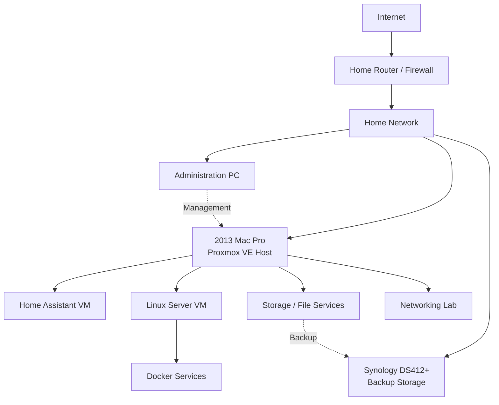

# Homelab Architecture

## Overview

The Mac Pro Homelab is designed around a 2013 Mac Pro running Proxmox VE as the primary virtualization host.

The environment will be used to develop hands-on experience with virtualization, Linux administration, containers, home automation, networking, storage, monitoring, and infrastructure troubleshooting.

## Planned Architecture

## Physical Infrastructure

### Mac Pro

The 2013 Mac Pro serves as the main virtualization host.

Planned responsibilities include:

- Running Proxmox VE
- Hosting virtual machines
- Hosting Linux services
- Running Home Assistant
- Supporting networking experiments
- Providing selected storage services

### Synology DS412+

The Synology NAS provides separate network storage and can be used as a backup destination for important homelab data.

Keeping backup storage separate from the virtualization host helps prevent a single hardware failure from affecting both production data and backups.

### Administration Computer

A separate workstation will be used to administer the environment through:

- Proxmox web interface
- SSH
- Web-based service dashboards
- Remote management tools

## Virtual Infrastructure

### Home Assistant VM

Home Assistant will run as a dedicated virtual machine.

Primary purpose:

- Home automation
- IoT device management
- Automation testing

### Linux Server VM

A general-purpose Linux virtual machine will be used for:

- Linux administration
- SSH
- Docker
- Automation
- Server configuration
- Application hosting

### Docker Services

Docker containers will run inside the Linux server rather than directly on the Proxmox host.

This keeps the hypervisor focused on virtualization while application services remain isolated inside a virtual machine.

### Storage Services

Storage services will be used to experiment with:

- SMB file sharing
- Network storage
- Permissions
- Backup workflows
- Storage monitoring

### Networking Lab

The networking environment will eventually be used to practice:

- DHCP
- DNS
- Routing
- Firewall configuration
- VLANs
- Network segmentation
- Monitoring
- Troubleshooting

## Design Principles

The environment is being designed around several principles:

1. Keep the Proxmox host focused primarily on virtualization.
2. Separate application workloads using virtual machines and containers.
3. Maintain backups on separate physical hardware.
4. Document configuration changes and troubleshooting.
5. Introduce additional complexity gradually rather than deploying everything at once.

## Current Status

The virtualization host is currently offline pending replacement of the Mac Pro cooling fan.

Architecture planning and documentation are continuing while the hardware repair is completed.
